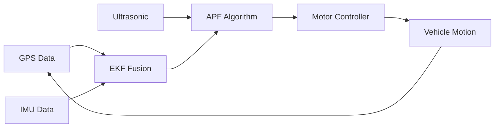
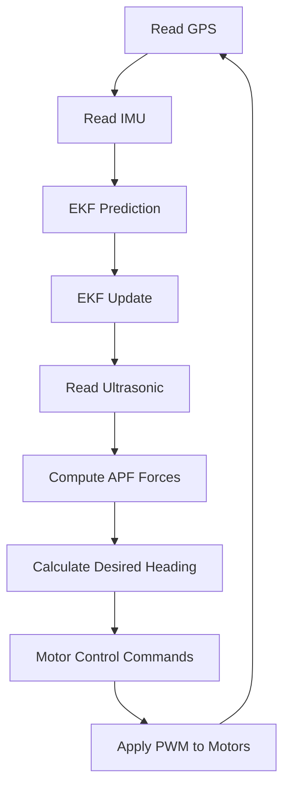

<div align="center">

<!-- Animated Header Wave -->


<!-- Animated Tagline -->
<p align="center">
  
</p>

<!-- Hero Badges -->
<p align="center">
  
  
  
  
</p>

<p align="center">
  
  
</p>

<!-- Project Stats -->
<p align="center">
  
  
  
  
</p>

<!-- Animated Divider -->


</div>

<br>

##  Project Overview


This project implements a **real-time, closed-loop navigation system** for an **Autonomous Surface Vehicle (ASV)** using cutting-edge algorithms and sensor fusion techniques.

### 🎯 **Core Technologies**

- 🧮 **Extended Kalman Filter (EKF)** — Drift-free sensor fusion
- 🧲 **Artificial Potential Field (APF)** — Dynamic obstacle avoidance
- 📡 **GPS + IMU Integration** — Precise positioning
- 🤖 **Differential Drive Control** — Autonomous navigation
- ⚡ **Real-Time Processing** — Sub-second decision making

### 🌊 **Navigation Philosophy**

Combining sensor fusion with intelligent path planning to create a fully autonomous marine vehicle capable of navigating complex environments with obstacles, GPS dropouts, and dynamic conditions.

<br clear="right">

<!-- Animated Divider -->


<br>

##  Key Features

<div align="center">

<table>
<tr>
<td width="33%" align="center">

<br><br>

<br><br>
**Quectel L89-S90**
<br><br>
✓ Real-time location
<br>
✓ Lat/Lon to XY conversion
<br>
✓ Meter-level accuracy
<br>
✓ NMEA parsing
</td>
<td width="33%" align="center">

<br><br>

<br><br>
**BNO055 9-DOF**
<br><br>
✓ Heading estimation
<br>
✓ Acceleration data
<br>
✓ Gyroscope fusion
<br>
✓ Magnetometer calibration
</td>
<td width="33%" align="center">

<br><br>

<br><br>
**Extended Kalman Filter**
<br><br>
✓ Sensor fusion
<br>
✓ Drift correction
<br>
✓ Velocity estimation
<br>
✓ Position smoothing
</td>
</tr>
<tr>
<td width="33%" align="center">

<br><br>

<br><br>
**Potential Field Planning**
<br><br>
✓ Attractive force to goal
<br>
✓ Repulsive from obstacles
<br>
✓ Closed-loop control
<br>
✓ Real-time adjustment
</td>
<td width="33%" align="center">

<br><br>

<br><br>
**HC-SR04 Sensors**
<br><br>
✓ Distance measurement
<br>
✓ Obstacle detection
<br>
✓ Multi-sensor array
<br>
✓ Real-time feedback
</td>
<td width="33%" align="center">

<br><br>

<br><br>
**Differential Drive**
<br><br>
✓ L298N motor driver
<br>
✓ 2 rear DC motors
<br>
✓ 1 passive caster wheel
<br>
✓ Smooth maneuvering
</td>
</tr>
</table>

</div>

<!-- Animated Divider -->


<br>

##  Hardware Architecture

<div align="center">

### 🔧 **Component Breakdown**

</div>

<table>
<tr>
<td width="50%" valign="top">

### 🎛️ **Core Components**

<br>

**⚡ ESP32 DevKit V1**
<br>

<br>
Dual-core 240MHz processor, WiFi/BT ready, real-time processing capability for sensor fusion and motor control.

<br><br>

**📡 Quectel L89-S90 GPS**
<br>

<br>
High-precision GPS module with NMEA output. Connected via UART (RX2/TX2). Provides lat/lon coordinates converted to local XY meters.

<br><br>

**🧭 Adafruit BNO055 IMU**
<br>

<br>
9-axis absolute orientation sensor with built-in sensor fusion. I2C interface (SDA=21, SCL=22). Provides heading, acceleration, gyroscope data.

<br><br>

**📏 HC-SR04 Ultrasonic Sensors**
<br>

<br>
1-3 sensors for obstacle detection. Range: 2cm to 400cm. Real-time distance feedback for APF algorithm.

</td>
<td width="50%" valign="top">

### ⚙️ **Actuation & Power**

<br>

**🚗 L298N Motor Driver**
<br>

<br>
Dual H-bridge motor driver. Controls 2 rear DC motors independently for differential drive. PWM speed control.

<br><br>

**⚙️ DC Motors (2x Rear)**
<br>

<br>
Two rear-mounted DC motors for movement. Single passive front caster wheel. Enables forward motion and turning.

<br><br>

**🔋 Power System**
<br>

<br>
7.4V or 12V battery pack for motor power. Separate 5V regulation for ESP32 and sensors. Proper power isolation.

<br><br>

**🔌 Wiring Configuration**
<br>

<br>
- GPS: UART (GPIO16/17)
- IMU: I2C (GPIO21/22)
- Motors: PWM + Digital pins
- Ultrasonic: Trigger/Echo pins

</td>
</tr>
</table>

<div align="center">

<br>

### 🔋 **Power Distribution**

```
Battery (7.4V-12V)
    │
    ├──> L298N Motor Driver ──> DC Motors (×2)
    │
    └──> 5V Regulator
            │
            ├──> ESP32 DevKit
            ├──> GPS Module
            ├──> BNO055 IMU
            └──> Ultrasonic Sensors
```

</div>

<!-- Animated Divider -->


<br>

##  Navigation Stack

<div align="center">

### 🧠 **Three-Layer Intelligence System**

</div>

<table>
<tr>
<td width="33%" align="center">

<br><br>

<br><br>
**GPS + IMU + EKF**
<br><br>
📡 Raw GPS coordinates
<br>
🧭 IMU heading & acceleration
<br>
🔄 Kalman filter fusion
<br>
📍 Drift-free position estimate
<br><br>
**Output:** Accurate XY position & velocity
</td>
<td width="33%" align="center">

<br><br>

<br><br>
**Artificial Potential Field**
<br><br>
🎯 Attractive force → Goal
<br>
🧲 Repulsive force ← Obstacles
<br>
📏 Ultrasonic distance data
<br>
⚖️ Force vector summation
<br><br>
**Output:** Desired heading & velocity
</td>
<td width="33%" align="center">

<br><br>

<br><br>
**Differential Drive**
<br><br>
🔄 Heading error calculation
<br>
⚡ Left/right motor PWM
<br>
🎮 Forward, turn, stop commands
<br>
🔁 Closed-loop adjustment
<br><br>
**Output:** Motor commands (L/R speed)
</td>
</tr>
</table>

<br>

### 🔄 **Complete Navigation Pipeline**



<div align="center">

**Closed-loop system with continuous feedback and correction**

</div>

<!-- Animated Divider -->


<br>

##  Algorithm Deep Dive

### 🎯 **Extended Kalman Filter (EKF)**


**Purpose:** Fuse GPS and IMU data to get drift-free position and velocity estimates.

**Why EKF?**
- GPS has **low frequency** but **absolute position**
- IMU has **high frequency** but **drifts over time**
- EKF combines both for **optimal estimation**

**Process:**
1. **Prediction Step:** Use IMU acceleration to predict next state
2. **Update Step:** Correct prediction using GPS measurements
3. **Covariance Update:** Track uncertainty in estimates
4. **Output:** Smooth, accurate position & velocity

**Key Parameters:**
- Process noise: Models IMU drift
- Measurement noise: Models GPS accuracy
- State vector: [x, y, vx, vy]

<br clear="right">

<br>

### 🧲 **Artificial Potential Field (APF)**


**Purpose:** Generate navigation commands by simulating attractive and repulsive forces.

**How It Works:**

**Attractive Force (Goal)**
```
F_attractive = K_att * (Goal - Current_Position)
```
Pulls the vehicle toward the target destination.

**Repulsive Force (Obstacles)**
```
F_repulsive = K_rep * (1/distance - 1/threshold) * direction
```
Pushes the vehicle away from detected obstacles.

**Total Force**
```
F_total = F_attractive + Σ F_repulsive
```

**Advantages:**
- ✅ Real-time obstacle avoidance
- ✅ Smooth trajectory generation
- ✅ No pre-computed path needed
- ✅ Adapts to dynamic environments

<br clear="right">

<!-- Animated Divider -->


<br>

##  Installation & Setup

### 📋 **Prerequisites**

<p>


</p>

### 🔧 **Required Libraries**

```cpp
// Install via Arduino Library Manager
#include <Adafruit_BNO055.h>      // IMU sensor library
#include <TinyGPS++.h>              // GPS parsing library
#include <Wire.h>                   // I2C communication
```

### 📥 **Installation Steps**

<table>
<tr>
<td width="33%" align="center">

<br><br>
```bash
git clone https://github.com/
yourusername/asv-navigation.git
cd asv-navigation
```
<br>
Clone the project repository
</td>
<td width="33%" align="center">

<br><br>
Open Arduino IDE
<br>
Install required libraries
<br>
Configure ESP32 board
<br>
Set COM port
</td>
<td width="33%" align="center">

<br><br>
Connect ESP32 via USB
<br>
Open main .ino file
<br>
Click Upload
<br>
Monitor serial output
</td>
</tr>
</table>

### 🔌 **Hardware Connections**

<div align="center">

| Component | ESP32 Pin | Notes |
|-----------|-----------|-------|
| **GPS RX** | GPIO 17 (TX2) | UART communication |
| **GPS TX** | GPIO 16 (RX2) | UART communication |
| **IMU SDA** | GPIO 21 | I2C data line |
| **IMU SCL** | GPIO 22 | I2C clock line |
| **Motor IN1** | GPIO 25 | Left motor control |
| **Motor IN2** | GPIO 26 | Left motor control |
| **Motor IN3** | GPIO 27 | Right motor control |
| **Motor IN4** | GPIO 14 | Right motor control |
| **Ultrasonic Trig** | GPIO 5 | Trigger pulse |
| **Ultrasonic Echo** | GPIO 18 | Echo response |

</div>

### ⚙️ **Configuration**

```cpp
// Adjust these parameters in config.h
#define GOAL_LAT 37.7749  // Target latitude
#define GOAL_LON -122.4194 // Target longitude
#define OBSTACLE_THRESHOLD 50 // cm
#define K_ATTRACTIVE 1.0  // APF attractive gain
#define K_REPULSIVE 2.0   // APF repulsive gain
```

<!-- Animated Divider -->


<br>

##  System Operation

### 🚀 **Startup Sequence**

```
1. Initialize serial communication (115200 baud)
2. Initialize I2C for BNO055 IMU
3. Initialize UART for GPS module
4. Calibrate IMU (wait for good calibration values)
5. Wait for GPS fix (valid NMEA data)
6. Initialize EKF with first GPS position
7. Enter main navigation loop
```

### 🔄 **Main Loop Execution**

<div align="center">



</div>

### 📊 **Real-Time Monitoring**

```cpp
// Serial output every loop iteration
Position: (12.34, 56.78) m
Velocity: (0.5, 0.2) m/s
Heading: 45.2°
Goal Distance: 15.3 m
Obstacle: 35 cm (FRONT)
Motor: L=180 R=150
Status: NAVIGATING
```

<!-- Animated Divider -->


<br>

##  Performance Characteristics

<div align="center">

<table>
<tr>
<td width="50%" align="center">

<br><br>

<br><br>
**GPS + EKF Fusion**
<br><br>
Typical accuracy with consumer GPS
<br>
Improved with IMU fusion
<br>
Better than GPS-only systems
</td>
<td width="50%" align="center">

<br><br>

<br><br>
**Real-Time Processing**
<br><br>
100ms loop time
<br>
Fast enough for marine navigation
<br>
Smooth motion control
</td>
</tr>
<tr>
<td width="50%" align="center">

<br><br>

<br><br>
**Ultrasonic Range**
<br><br>
HC-SR04 specifications
<br>
Adjustable avoidance threshold
<br>
Multi-sensor coverage
</td>
<td width="50%" align="center">

<br><br>

<br><br>
**IMU Precision**
<br><br>
BNO055 absolute orientation
<br>
Magnetometer calibration
<br>
Drift compensation
</td>
</tr>
</table>

</div>

<!-- Animated Divider -->


<br>

##  Future Enhancements

<table>
<tr>
<td width="50%" valign="top">

### 🚀 **Immediate Roadmap**

<br>

**🎮 PID Heading Control**
<br>

<br>
Replace bang-bang control with PID for smoother trajectory tracking and reduced oscillations.

<br><br>

**🗺️ Dynamic Re-routing**
<br>

<br>
Implement path replanning when trapped in local minima or facing unexpected obstacles.

<br><br>

**📊 Data Logging**
<br>

<br>
Add SD card logging for position, velocity, sensor data, and motor commands for post-analysis.

</td>
<td width="50%" valign="top">

### 🌟 **Advanced Features**

<br>

**📡 Telemetry System**
<br>

<br>
Bluetooth/WiFi telemetry for real-time monitoring and remote control capability.

<br><br>

**🗺️ Marine Map Integration**
<br>

<br>
Integrate Navionics or NOAA marine charts for depth awareness and coastal navigation.

<br><br>

**🤖 Machine Learning**
<br>

<br>
Explore RL algorithms for optimal navigation policy learning in various conditions.

</td>
</tr>
</table>

<!-- Animated Divider -->


<br>

##  Media Gallery

<div align="center">

### 📷
